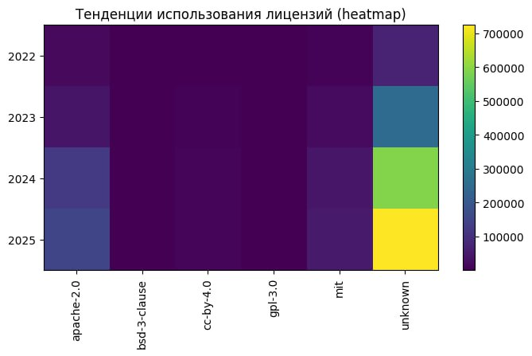
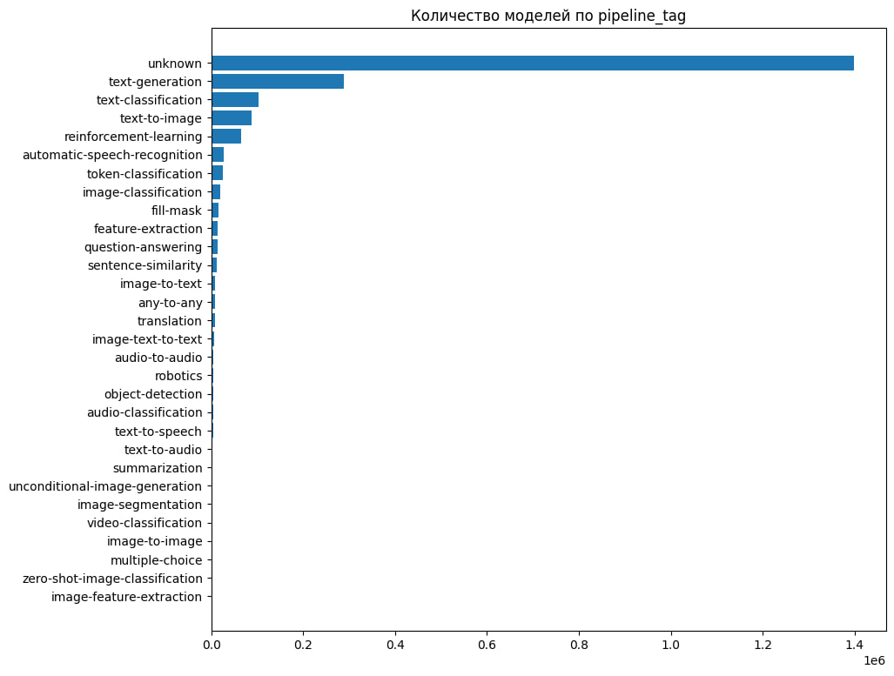
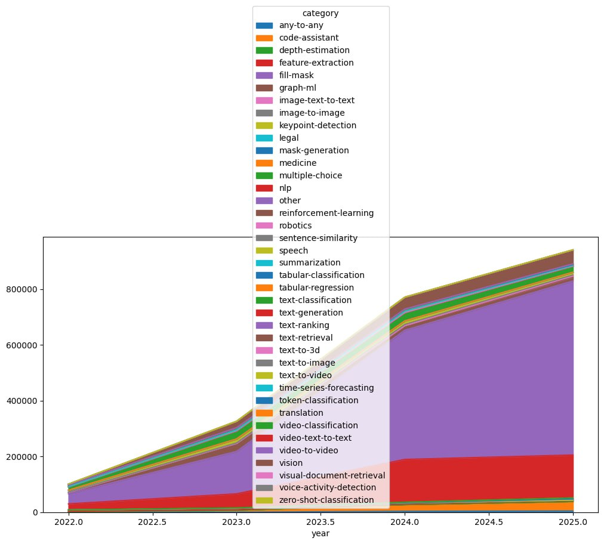
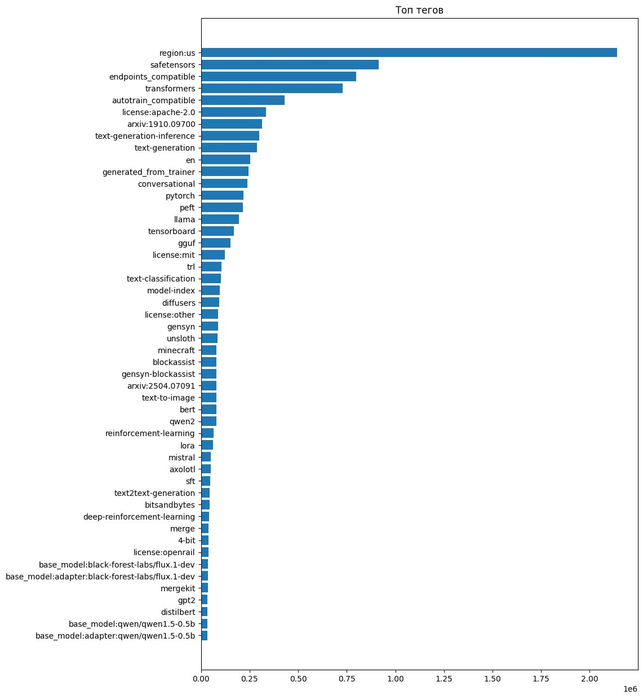

# Первичная аналитика датасета Hugging Face Models

## Общая информация

**Источник данных:** Hugging Face Hub 

**Тип данных:** Метаданные моделей (нейронные сети)

**Структура хранения:** PostgreSQL (таблица моделей)

---

## Структура данных (основная таблица)

| Поле           | Тип       | Описание                                                                          |
| -------------- | --------- | --------------------------------------------------------------------------------- |
| `id`           | SERIAL    | Уникальный идентификатор записи                                                   |
| `model_id`     | TEXT      | Уникальный ID модели в формате `author/model_name`                                |
| `pipeline_tag` | TEXT      | Основной тип пайплайна модели (например, `text-generation`, `image-text-to-text`) |
| `license`      | TEXT      | Тип лицензии (например, `mit`, `apache-2.0`)                                      |
| `downloads`    | INTEGER   | Количество скачиваний модели                                                      |
| `private`      | BOOLEAN   | Признак приватности модели                                                        |
| `tags`         | JSONB     | Список тегов модели                                                               |
| `likes`        | INTEGER   | Количество лайков модели                                                          |
| `createdAt`    | TIMESTAMP | Дата создания репозитория                                                         |
| `lastModified` | TIMESTAMP | Последняя дата изменения                                                          |
| `cardData`     | JSONB     | Дополнительные данные карточки модели                                             |
| `config`       | JSONB     | Конфигурационные параметры                                                        |
| `gated`        | BOOLEAN   | Признак ограничения доступа                                                       |
| `siblings`     | JSONB     | Список файлов репозитория                                                         |
| `raw_data`     | JSONB     | Исходный JSON-объект модели                                                       |

---

## Пример структуры одной записи (JSON)

```json
{
  "id": "deepseek-ai/DeepSeek-OCR",
  "_id": "68f1e08ddba20aca9c602acb",
  "sha": "ee668a444ce026b7a23944f36692df1cdba54de9",
  "gguf": null,
  "tags": [
    "safetensors",
    "deepseek_vl_v2",
    "deepseek",
    "vision-language",
    "ocr",
    "custom_code",
    "image-text-to-text",
    "multilingual",
    "arxiv:2510.18234",
    "license:mit",
    "region:us"
  ],
  "gated": false,
  "likes": 1687,
  "author": "deepseek-ai",
  "config": null,
  "spaces": null,
  "modelId": "deepseek-ai/DeepSeek-OCR",
  "private": false,
  "cardData": null,
  "disabled": null,
  "siblings": [
    { "rfilename": ".gitattributes", "size": null, "blob_id": null, "lfs": null },
    { "rfilename": ".ipynb_checkpoints/README-checkpoint.md", "size": null, "blob_id": null, "lfs": null },
    { "rfilename": "LICENSE", "size": null, "blob_id": null, "lfs": null },
    { "rfilename": "README.md", "size": null, "blob_id": null, "lfs": null },
    { "rfilename": "assets/fig1.png", "size": null, "blob_id": null, "lfs": null },
    { "rfilename": "assets/show1.jpg", "size": null, "blob_id": null, "lfs": null },
    { "rfilename": "assets/show2.jpg", "size": null, "blob_id": null, "lfs": null },
    { "rfilename": "assets/show3.jpg", "size": null, "blob_id": null, "lfs": null },
    { "rfilename": "assets/show4.jpg", "size": null, "blob_id": null, "lfs": null },
    { "rfilename": "config.json", "size": null, "blob_id": null, "lfs": null },
    { "rfilename": "configuration_deepseek_v2.py", "size": null, "blob_id": null, "lfs": null },
    { "rfilename": "conversation.py", "size": null, "blob_id": null, "lfs": null },
    { "rfilename": "deepencoder.py", "size": null, "blob_id": null, "lfs": null },
    { "rfilename": "model-00001-of-000001.safetensors", "size": null, "blob_id": null, "lfs": null },
    { "rfilename": "model.safetensors.index.json", "size": null, "blob_id": null, "lfs": null },
    { "rfilename": "modeling_deepseekocr.py", "size": null, "blob_id": null, "lfs": null },
    { "rfilename": "modeling_deepseekv2.py", "size": null, "blob_id": null, "lfs": null },
    { "rfilename": "processor_config.json", "size": null, "blob_id": null, "lfs": null },
    { "rfilename": "special_tokens_map.json", "size": null, "blob_id": null, "lfs": null },
    { "rfilename": "tokenizer.json", "size": null, "blob_id": null, "lfs": null },
    { "rfilename": "tokenizer_config.json", "size": null, "blob_id": null, "lfs": null }
  ],
  "card_data": null,
  "downloads": 487614,
  "inference": null,
  "created_at": "2025-10-17T06:22:05+00:00",
  "mask_token": null,
  "model_index": null,
  "safetensors": null,
  "widget_data": null,
  "xet_enabled": null,
  "lastModified": "2025-10-23T04:55:52+00:00",
  "library_name": null,
  "pipeline_tag": "image-text-to-text",
  "last_modified": "2025-10-23T04:55:52+00:00",
  "trending_score": 1687,
  "transformersInfo": null,
  "transformers_info": null,
  "downloads_all_time": null,
  "security_repo_status": null,
  "inference_provider_mapping": null
}

```

---

## Задачи анализа нейросетевых моделей

1. **Кластеризация архитектур нейросетей:** определить ключевые архитектурные группы моделей (transformer, diffusion, CNN и др.) и выявить закономерности их развития.


2. **Динамика тематического роста:** проанализировать изменение количества моделей по областям применения за последние 5 лет, чтобы определить наиболее быстрорастущие направления.


3. **Определение лидеров рынка:** выявить крупнейших авторов и организации, активно публикующих и развивающих нейросетевые модели.


4. **Анализ лицензий и коммерциализации:** изучить распределение лицензий по типам и годам, чтобы оценить степень открытости и коммерциализации рынка ИИ.

---

## Анализ метрик нейросетей

### 1. Тепловая карта использования лицензий


* Сильное преобладание категории `unknown` — это означает, что у значительной части моделей не указана лицензия
* Среди определённых лицензий чаще всего встречаются `MIT` и `Apache-2.0`, что типично для open-source проектов
* С 2024 года заметен рост моделей с явно указанными лицензиями, что говорит о тенденции к большей прозрачности и легализации использования кода

> Примечание: необходимо провести ручную валидацию и доразметку лицензий, чтобы исключить неопределённые значения и получить более точную картину коммерциализации рынка

---

### 2. Количество моделей по типу датасета


* Почти 1,4 миллиона моделей имеют тег `unknown`, что указывает на неполноту данных
* Среди классифицированных категорий лидируют `text-generation`, `text-classification`, и `text-to-image`, это отражает общий тренд на развитие генеративных и текстовых моделей (LLM)

>Примечание: необходимо выполнить доразметку тегов, особенно для моделей с неизвестным назначением, это позволит точнее оценить распределение по прикладным областям

---

### 3. Количество моделей по областям использования



* С 2023 по 2025 год наблюдается экспоненциальный рост числа моделей, особенно в категориях `nlp`, `text-generation`, `text-classification`, `vision` и `code-assistant`
* Активное развитие также идёт в направлениях `reinforcement-learning`, `speech`, `medicine`, `legal` и `robotics` эти категории становятся всё более важными
* Появляются новые направления, ранее не представленные в 2022 году

>Примечание: необходимо провести дополнительную категоризацию моделей, особенно в группах с метками `other` и `unknown`, чтобы точнее отразить динамику развития отдельных отраслей

---

### 4. Анализ тегов моделей


1. Тег "region:us" выделяется на графике, значительно превосходя другие по частоте. Это может означать, что большинство моделей или параметров, которые анализируются, связаны с американским регионом

2. Тег "safensensors" также выделяется среди других, что может указывать на повышенное внимание к безопасности сенсоров или технологий, использующих их

3. Теги "transformers", "autotrain_compatible", "license:apache2.0", "license:mit" указывают на активное использование популярных библиотек и открытых лицензий в проектах

4. Частые упоминания "llama", "mistral", "axolotl" и тегов, связанных с обучением с подкреплением, отражают популярность современных архитектур и подходов в машинном обучении

5. Теги задач, такие как "text-generation", "text-classification" и "text2image", демонстрируют основной фокус на генеративных и языковых моделях

>Примечание: необходимо провести дополнительную классификацию тегов для повышения точности аналитики и выявления рыночных трендов

