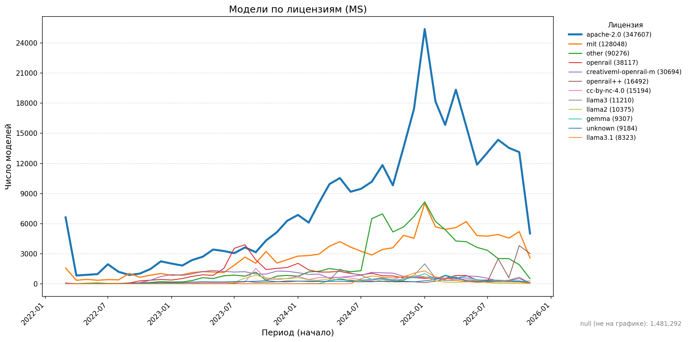
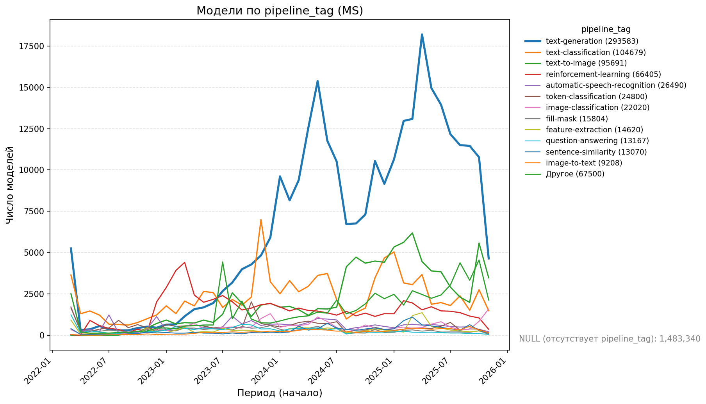
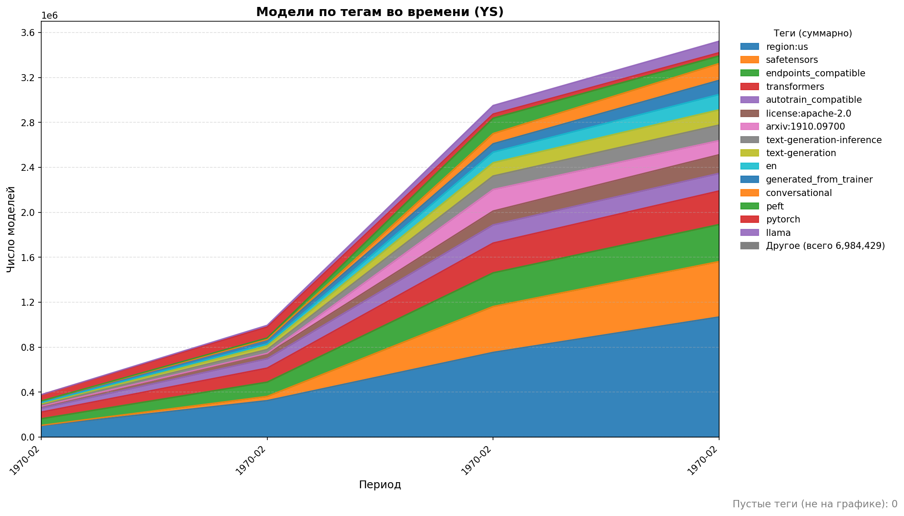
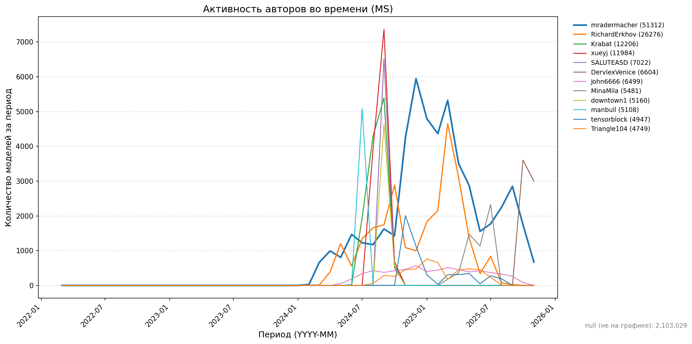
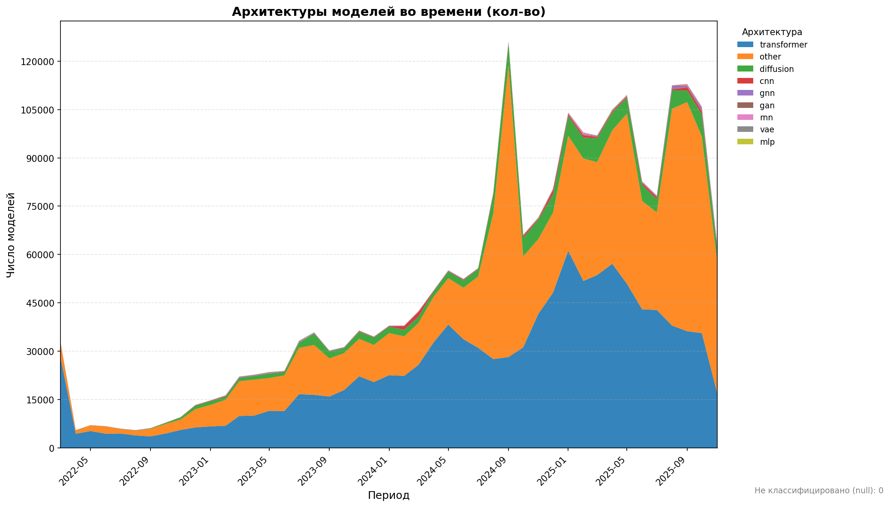
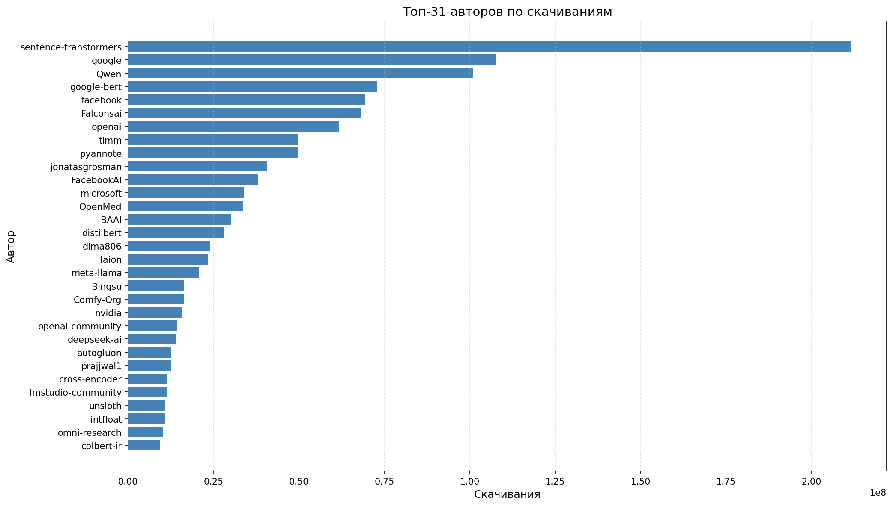
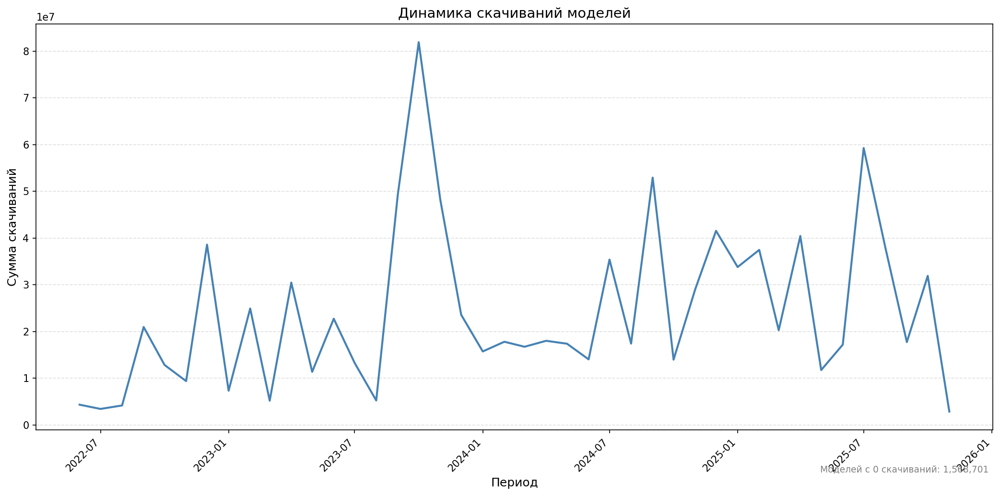

# Аналитика датасета Hugging Face Models 
## На полном датасете с 2 миллионами моделей

## 1. Динамика использования лицензий

* Лицензия Apache-2.0 доминирует с огромным отрывом, особенно в 2024–2025, это указывает на стандартизацию и массовое принятие этой лицензии в open-source
* MIT-лицензия стабильно держит вторую позицию, но её рост значительно слабее, чем у Apache-2.0
* Наблюдается кратковременный всплеск моделей со смешанными и специализированными лицензиями (openrail, creative-ml, llama-friendly и др.), что отражает усиление юридической защиты и новых правил для генеративных моделей

> Вывод: рынок стремительно уходит от неопределённых лицензий к чётким open-source юридическим моделям. Apache-2.0 становится индустриальным стандартом, а вместе с тем растёт доля моделей с ограничительными AI-лицензиями. Однако важно учитывать, что данные отражают преимущественно open-source экосистему Hugging Face и не включают закрытые коммерческие модели крупных корпораций, которые также формируют глобальные тенденции

## 2. Анализ коммерциализации рынка

* text-generation доминирует весь период, пик приходится на 2024–2025, это прямое подтверждение бума LLM
* Среди классифицированных категорий лидируют `text-generation`, `text-classification`, и `text-to-image`, это отражает общий тренд на развитие генеративных и текстовых моделей (LLM)
* Яркий рост text-to-image синхронизируется с волной diffusion-моделей и моделей мультимодальности
* speech-recognition, question-answering, image-to-text растут как вспомогательные категории, поддерживающие экосистему ИИ-агентов

>Вывод: отрасль демонстрирует устойчивый тренд на расширение функциональности моделей, от классических текстовых архитектур к мультимодальным системам, способным работать с изображениями, аудио и видеоданными. Однако, несмотря на рост мультимодальности, генерация текста остаётся центральным направлением развития: именно LLM-модели продолжают доминировать как по популярности, так и по объёму релизов. Это отражает зрелость NLP-технологий и высокий спрос на универсальные языковые системы, которые служат ядром новых AI-продуктов

## 3. Распределение моделей по тегам

* region:us большинство моделей англоязычные
* safetensors, pytorch, transformers — формируют инфраструктурный стек современной ML-разработки
* text-generation, generated_from_trainer, llama, peft, conversational, взрывной рост с 2023 года показывает массовый переход от ручного ML к fine-tuning LLM
* Значительный рост тега peft, подтверждает акцент на эффективном обучении (LoRA, QLoRA)

>Вывод: динамика тегов показывает смещение индустрии от разработки моделей "с нуля" к активному переобучению и тонкой настройке уже существующих архитектур. Рост тегов, связанных с fine-tuning и PEFT-технологиями, подтверждает, что рынок стандартизируется вокруг foundation моделей. Преобладание англоязычных тегов отражает доминирование английского языка в ML-экосистеме, однако это не является признаком страны происхождения моделей

## 4. Анализ лидеров авторов и организаций

* Большая часть моделей создаётся индивидуальными авторами, а не корпорациями
* С 2024 года наблюдается взрывная активность отдельных авторов, вероятно связанная с массовым появлением LoRA-адаптеров, fine-tuning фреймворков и AutoTrain систем
* Видны высокие пики публикаций, что говорит о пакетном релизе сотен моделей сразу (не ручная разработка, а автоматизация и ускоренные пайплайны)
* После пиков заметен спад активности к концу 2025, что может означать переход к качеству вместо количества
* Корпоративных игроков почти нет, крупные компании публикуют мало моделей или делают это на закрытых платформах

>Вывод: рынок генеративных моделей пережил фазу массового fine-tuning’а, где независимые разработчики стали ключевыми драйверами роста. Большинство моделей — это производные (fine-tuned) версии крупных базовых моделей, а не разработки «с нуля», что подтверждает тренд на локальную персонализацию ИИ. Отсутствие крупных компаний в топе признак того, что корпоративные игроки смещаются в сторону закрытых моделей и внутренних решений

## 5. Доля моделей по использованию современных архитектур

* Большая часть новых моделей основана на Transformer архитектуре, но время от времени видны провалы, они связаны не с падением интереса, а всплесками других типов (в основном diffusion-моделей)
* Всплески diffusion моделей наблюдаются периодически (видимо, волны вокруг релизов Stable Diffusion 2.x / SDXL / LoRA-инструментов)
* CNN и GAN постепенно уходят на второй план, оставаясь нишевыми для отдельных задач (компьютерное зрение, художественная генерация)
* GNN, RNN, VAE и MLP минимальная доля, подтверждая, что классические архитектуры используют реже

>Вывод: индустрия окончательно стандартизировалась на Transformer-архитектуре, которая стала фундаментом для почти всех задач ИИ. Диффузионные модели удерживают вторую нишу, подтверждая устойчивый спрос на генерацию изображений. Рынок показывает глубокую технологическую унификацию, где развитие идёт не через появление новых архитектур, а через масштабирование, оптимизацию, дообучение и мультимодальность

## 6. Топ авторов/организаций 

* Facebook, OpenAI, Microsoft, NVIDIA и Meta имеют десятки миллионов скачиваний, демонстрируя масштабный интерес к их моделям
* Falconsai, Qwen, Comfy-Org, lmstudio-community показывают, что популярность open-source моделей растёт
* Pyannote (аудио/речевые модели), OpenMed (медицинские модели) показывают устойчивый интерес к специализированным областям
* GNN, RNN, VAE и MLP минимальная доля, подтверждая, что классические архитектуры используют реже

>Вывод: активность open-source сообществ и нишевых моделей показывает, что инновации продолжаются, особенно в специализированных областях. Популярность моделей сильно коррелирует с известностью авторов/организаций и их экосистемой

## 7. Динамика активности скачиваний моделей

* Начиная с сентября 2022, скачивания резко увеличились, что совпадает с релизами крупных моделей и ростом интереса к нейросетям
* Резкий всплеск скачиваний моделей в октябре 2023 года связан с тем, что OpenAI активно продвигала ChatGPT, включая бесплатный доступ к GPT‑4 через веб‑интерфейс, а соцсети — YouTube, X (Twitter) и Reddit — буквально взорвались примерами генеративного контента: текстов, кода и иллюстраций
* Повторяющиеся “волны интереса”. В 2024–2025 годах скачивания продолжают показывать циклы всплесков и спадов, что может быть связано с релизами новых моделей, апдейтами популярных моделей и массовым внедрением AI-инструментов
* Стабильная базовая активность между всплесками. Даже периоды без крупных пиков показывают десятки миллионов скачиваний, что говорит о постоянно растущей пользовательской базе и интересе к моделям

>Вывод: индустрия нейросетевых моделей переживает циклы массового интереса, связанные с выходом популярных моделей и обновлений. Основная тенденция — рост базовой активности и периодические “волны” скачиваний, отражающие всплески интереса к новым релизам