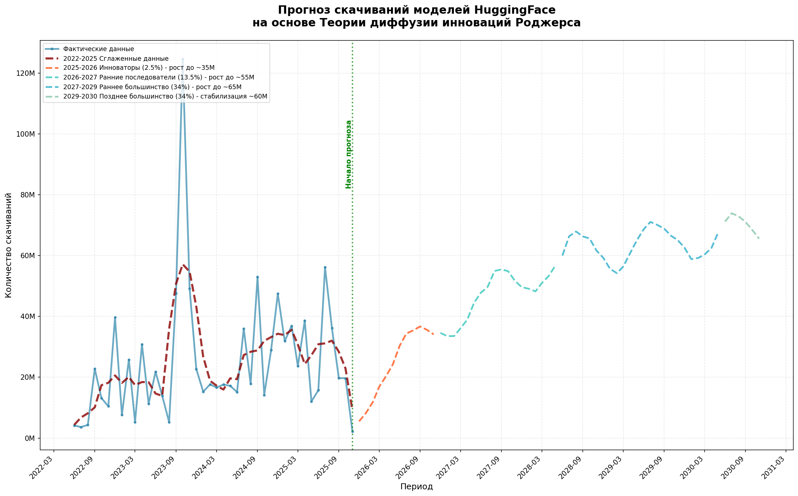

# Аналитика датасета Hugging Face Models 
## Прогнозирование темпов развития рынка ИИ

23 октября 2025 года в издании The New York Times было опубликовано интервью (ссылка на источник https://www.nytimes.com/2025/10/23/opinion/ai-bubble-economy-bust.html) с экономистом Джейсоном Фурманом, в котором он заявил, что рынок искусственного интеллекта стремительно растёт, но может быть переоценён и напоминает «пузырь», подобный дотком-кризису 2000-х годов. По его словам, сегодня ИИ стал главным драйвером инвестиций в сферу IT, однако эффект на реальную производительность пока не подтверждён статистически. Тем не менее Фурман отмечает, что даже если нынешний рост частично спекулятивен, такие «пузыри» нередко сопровождают крупные технологические революции — как это было с железными дорогами, электричеством и интернетом, которые, пройдя через переоценку, стали основой будущего прогресса.

В нашем исследовании попробуем рассмотреть активность рынка с 2022 года, проанализировать рост за 4 года, и попробуем предсказать темп активности ии рынка до 2030 года.

### Теория диффузии инноваций Роджерса

Теория Роджерса описывает процесс распространения новых технологий в обществе через пять последовательных групп:
- **Инноваторы (2.5%)** - технологические энтузиасты
- **Ранние последователи (13.5%)** - visionaries, формирующие тренды
- **Раннее большинство (34%)** - практичные пользователи
- **Позднее большинство (34%)** - скептики, присоединяющиеся под давлением
- **Опоздавшие (16%)** - традиционалисты

На основе исторических данных за 2022-2025 годы была построена композитная модель:
Прогноз = Базовый уровень × Тренд × Сезонность × Случайность

**Ключевые параметры модели:**
- Историческое среднее: 28M скачиваний/месяц
- Коэффициент вариации: 78% (высокая волатильность)
- Сезонные паттерны: весенние и осенние пики активности
- Фазовые переходы с плавными весовыми коэффициентами

### Расчет фаз развития

**Фаза 1: Инноваторы (2025-2026)**
- Длительность: 12 месяцев
- Целевой уровень: ~35M
- Характеристика: освоение технологического скачка 2023-2025

**Фаза 2: Ранние последователи (2026-2027)**
- Длительность: 18 месяцев  
- Целевой уровень: ~55M
- Характеристика: рост adoption среди технических специалистов

**Фаза 3: Раннее большинство (2027-2029)**
- Длительность: 24 месяца
- Целевой уровень: ~65M
- Характеристика: массовое внедрение в индустрии

**Фаза 4: Позднее большинство (2029-2030)**
- Длительность: 6 месяцев
- Целевой уровень: ~60M
- Характеристика: стабилизация и насыщение рынка

>Важное уточнение: Цель прогнозирования - не предсказать точные ежемесячные значения, а определить **порядок цифр** и **общую тенденцию**. 

## Факторы, влияющие на прогноз

### Позитивные факторы (возможный рост выше прогноза)
- **Технологические прорывы** - появление AGI (Artificial General Intelligence) или новых архитектур моделей
- **Регуляторная поддержка** - государственные программы развития ИИ
- **Интеграция в образование** - включение ИИ в учебные программы вузов
- **Новые бизнес-модели** - монетизация open-source моделей

### Негативные факторы (возможное снижение ниже прогноза)
- **Регуляторные ограничения** - запреты на использование ИИ в отдельных сферах
- **Технологические плато** - замедление темпов улучшения моделей, нехватка вычислительных ресурсов
- **Экономические кризисы** - сокращение инвестиций в ИИ
- **Кибербезопасность** - крупные инциденты с моделями ИИ

**Пятилетний горизонт прогнозирования выбран как оптимальный баланс между точностью и дальновидностью: этот период соответствует типичным циклам развития ИИ-технологий и бизнес-планирования, сохраняя научную обоснованность, тогда как за пределами 2030 года влияние случайных факторов резко возрастает, открывая возможности для различных сценариев — от технологического насыщения до полной смены парадигм.**

## Выводы 

ИИ не является технологическим пузырем, что подтверждает выводы сделанные в интервью The New Work Times

Прогноз показывает, что рынок скачиваний ИИ-моделей движется к **зрелости и устойчивому развитию**. Ожидаемый рост до 60-65 млн скачиваний в месяц к 2030 году отражает естественный процесс прорывной технологии.

Главный тренд: ИИ становится стандартным инструментом, а не экзотической новинкой. Это позитивный сценарий, свидетельствующий о здоровом развитии экосистемы искусственного интеллекта.
